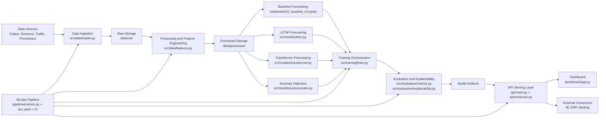

# AI E-Commerce Intelligence Platform

An end-to-end machine learning system for e-commerce sales forecasting and anomaly detection, designed with production-style architecture patterns used in industry teams.

## Problem Statement

E-commerce operations need reliable demand forecasts and fast anomaly detection to prevent stockouts, revenue loss, and delayed incident response. Most academic projects stop at model notebooks, while real companies need a complete system that includes data pipelines, model serving, monitoring, and retraining.

## Solution Overview

This repository implements an AI intelligence platform that:

- Ingests and versions e-commerce time-series data
- Builds clean, model-ready features
- Trains multiple forecasting and anomaly models
- Serves predictions through an API
- Visualizes insights in a dashboard
- Automates retraining through an MLOps pipeline

The architecture supports both experimentation (notebooks) and operational workflows (API + pipelines + tests + CI).

## System Architecture

### Why This Architecture Matches Real Companies

- Separation of concerns: Data, modeling, serving, and orchestration are isolated to reduce coupling.
- Offline/online split: Training happens offline, while API inference supports low-latency online use cases.
- Reproducibility: DVC and modular code make data + model runs trackable.
- Operational readiness: CI, tests, Docker, and scheduled retraining mirror production ML practice.
- Extensibility: New models or features can be added without rewriting the whole stack.

### End-to-End Data Flow

1. Raw data from commerce sources (orders, revenue, traffic, promos) lands in `data/raw`.
2. Preprocessing pipeline (`preprocess_pipeline.py`) orchestrates cleaning and feature engineering:
   - Merges stores, oil prices, transactions, and holiday events
   - Handles missing values with intelligent imputation strategies
   - Removes duplicates and validates data quality
   - Generates 23 engineered features (temporal, lag-based, external signals)
3. Curated datasets are saved to `data/processed/` as Parquet files:
   - `train.parquet` (2.9M rows, 97.3%) - 2013-01-01 to 2017-06-30
   - `val.parquet` (53K rows, 1.8%) - 2017-07-01 to 2017-07-30
   - `test.parquet` (28K rows, 1.0%) - 2017-07-31 to 2017-08-15
   - `full_featured.parquet` (3.0M rows) - Full dataset with all engineered features
4. Model training pipelines use processed datasets to train:
   - Forecasting models (baseline ML, LSTM, Transformer)
   - Anomaly detection models (autoencoder/statistical rules)
5. Evaluation computes forecasting and anomaly metrics, and explainability artifacts.
6. Best model artifacts are registered and loaded by the API service.
7. API exposes forecast and anomaly endpoints for downstream products.
8. Dashboard consumes API outputs for business users.
9. Scheduled retraining pipeline reprocesses data, retrains models, validates quality, and redeploys.

### Component Communication

- Data layer -> Training layer: File-based datasets (versioned) and reusable feature modules.
- Training layer -> Evaluation layer: Predictions and labels flow into metrics and explainability modules.
- Training/Evaluation -> API layer: Validated model artifacts are loaded by API runtime.
- API layer -> Dashboard: Dashboard calls REST endpoints for forecasts, anomalies, and model status.
- MLOps layer -> All core layers: Pipeline orchestrator triggers data prep, training, validation, and deployment.

## Architecture Diagram



Static architecture asset:



## Features

- **Production-grade preprocessing pipeline**: Intelligent missing value handling, duplicate removal, and chronological train/val/test splits with zero data leakage
- **Advanced time-series feature engineering**: Lag features (1-day, 7-day), rolling averages, oil price trends, and payday indicators for retail patterns
- Multi-model forecasting pipeline for time-series demand prediction
- Anomaly detection for suspicious sales behavior and trend breaks
- API-first serving layer for model inference and integrations
- Dashboard-ready outputs for business and operations teams
- Automated retraining workflow for model freshness
- Test suite and CI workflow for reliability
- Containerized services for consistent deployment

## ML Models Used

- Baseline forecasting models: classical/statistical and ML baselines for benchmark tracking
- LSTM (PyTorch): sequence modeling for temporal dependencies
- Transformer-based forecasting: long-range dependency handling
- Autoencoder-based anomaly detection: reconstruction-error-driven outlier detection

## Project Structure

```text
ai-ecommerce-intelligence/
├── data/
│   ├── raw/                 # Raw source data (gitignored, DVC-tracked)
│   │   ├── train.csv        # Historical sales transactions
│   │   ├── stores.csv       # Store metadata and locations
│   │   ├── oil.csv          # Daily oil prices (economic indicator)
│   │   ├── holidays_events.csv  # National/regional holiday calendar
│   │   └── transactions.csv # Daily store transaction counts
│   └── processed/           # Clean, feature-ready datasets
│       ├── train.parquet    # Training split (2.9M rows)
│       ├── val.parquet      # Validation split (53K rows)
│       ├── test.parquet     # Test split (28K rows)
│       ├── full_featured.parquet  # Complete dataset with 23 features
│       └── preprocessing_report.txt  # Quality report and feature summary
├── preprocess_pipeline.py   # Main preprocessing orchestration script
├── notebooks/
│   ├── 01_eda.ipynb         # Data exploration and quality checks
│   ├── 02_baseline_ml.ipynb # Baseline forecasting experiments
│   ├── 03_lstm_pytorch.ipynb
│   ├── 04_transformer_darts.ipynb
│   └── 05_anomaly_detection.ipynb
├── src/
│   ├── data/
│   │   ├── loader.py        # Data loading and ingestion logic
│   │   ├── preprocess.py    # RetailPreprocessor class with fit/transform pipeline
│   │   └── features.py      # Feature engineering transformations
│   ├── models/
│   │   ├── lstm.py          # LSTM model definitions/utilities
│   │   ├── autoencoder.py   # Anomaly detection model logic
│   │   └── transformer.py   # Transformer forecasting model logic
│   ├── training/
│   │   └── train.py         # Centralized training orchestration
│   └── evaluation/
│       ├── metrics.py       # Forecast and anomaly metrics
│       └── explainability.py# Feature impact/model interpretation
├── api/
│   ├── main.py              # FastAPI entrypoint and routes
│   ├── schemas.py           # Request/response schemas
│   └── Dockerfile           # API container image
├── dashboard/
│   ├── app.py               # Monitoring and business dashboard app
│   └── Dockerfile           # Dashboard container image
├── pipelines/
│   └── retrain.py           # Scheduled retraining and validation jobs
├── tests/
│   ├── test_api.py          # API contract and endpoint tests
│   └── test_models.py       # Model behavior and regression tests
├── .github/workflows/ci.yml # CI pipeline (tests, checks, quality gates)
├── docker-compose.yml       # Local multi-service orchestration
├── dvc.yaml                 # Data/model pipeline stages
├── requirements.txt         # Python dependencies
└── README.md
```

### Folder Roles (Quick View)

- `data`: source and transformed datasets for training and evaluation
- `notebooks`: research and model prototyping workspace
- `src`: reusable production code (data, models, training, evaluation)
- `api`: inference service for online predictions
- `dashboard`: visualization layer for operations and analytics
- `pipelines`: automation scripts for retraining and lifecycle tasks
- `tests`: quality and regression safeguards
- `.github/workflows`: CI automation and quality gates

## Preprocessing Pipeline

### Overview

The preprocessing pipeline (`preprocess_pipeline.py`) transforms raw e-commerce transaction data into production-ready datasets with:

- **Zero missing values**: Intelligent imputation strategies (oil prices forward-filled, transactions store-median-filled, holidays zero-filled)
- **Chronological train/val/test split**: 97.3% train, 1.8% val, 1.0% test (2013-2017) with zero data leakage
- **23 engineered features** including:
  - **Temporal**: day_of_week, month, quarter, is_weekend, is_month_start, is_month_end
  - **Lag-based memory**: lag_1, lag_7 (1 and 7-day sales lags), roll_mean_7 (7-day rolling average)
  - **Oil price trend**: oil_trend_7d (7-day smoothed Brent crude)
  - **Payday indicator**: is_payday (15th and last day of month—key retail pattern in Ecuador)
  - **Store & product**: store_nbr, family, city, state, cluster, type
  - **Sales metrics**: sales (target), onpromotion, has_promotion, transactions
  - **Holiday calendar**: type, locale, transferred, is_holiday

### Generated Datasets

- **train.parquet** (2.9M rows): 2013-01-01 to 2017-06-30 — training data for all model types
- **val.parquet** (53K rows): 2017-07-01 to 2017-07-30 — validation/tuning data
- **test.parquet** (28K rows): 2017-07-31 to 2017-08-15 — final evaluation data
- **full_featured.parquet** (3.0M rows): complete dataset with all 23 features for exploratory analysis

### Running Preprocessing

```bash
python preprocess_pipeline.py
```

Output: `data/processed/` with parquet files and `preprocessing_report.txt` quality summary.

## Installation

### 1. Clone Repository

### 2. Create Virtual Environment (Windows PowerShell)

```powershell
python -m venv .venv
.\.venv\Scripts\Activate.ps1
```

### 3. Install Dependencies

```bash
pip install -r requirements.txt
```

### 4. (Optional) Pull Versioned Data With DVC

```bash
dvc pull
```

## Run The Project

### Step 1: Preprocess Raw Data (Generate Model-Ready Datasets)

```bash
python preprocess_pipeline.py
```

This step:

- Loads raw data from `data/raw/`
- Cleans missing values and removes duplicates
- Engineers 23 features (lags, trends, temporal indicators, holiday calendar)
- Generates chronologically-split parquet files in `data/processed/`
- Outputs quality report to `data/processed/preprocessing_report.txt`

**Output**: Train/val/test parquet files ready for model training.

### Step 2: Run Training Pipeline

```bash
python -m src.training.train
```

### Run API Service

```bash
uvicorn api.main:app --host 0.0.0.0 --port 8000 --reload
```

### Step 3: Run Dashboard

```bash
python dashboard/app.py
```

### Step 4: Run Retraining Job

```bash
python pipelines/retrain.py
```

### Run All Services With Docker Compose

```bash
docker-compose up --build
```

### Run Tests

```bash
pytest -q
```
